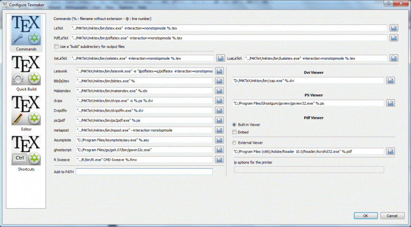

#Como configurar Texmarker portable con Miktex portable
  
##Bajar:

[MiKTeX Portable](http://mirrors.ctan.org/systems/win32/miktex/setup/miktex-portable-2.9.5719.exe)  
[Texmaker USB](http://www.xm1math.net/texmaker/texmakerwin32usb.zip)  
  
  
##Configuar Texmarker con la ruta de nuestra carpeta MiKTex:  
  

 
```
LaTeX: "../MiKTeX/miktex/bin/latex.exe" -interaction=nonstopmode %.tex
PdfLaTeX: "../MiKTeX/miktex/bin/pdflatex.exe" -interaction=nonstopmode %.tex
XeLaTeX: "../MiKTeX/miktex/bin/xelatex.exe" -interaction=nonstopmode %.tex
LuaLaTeX: "../MiKTeX/miktex/bin/lualatex.exe" -interaction=nonstopmode %.tex
Latexmk: "../MiKTeX/miktex/bin/latexmk.exe" -e "$pdflatex=q/pdflatex -interaction=nonstopmode/" -pdf %.tex
Bib(la)tex: "../MiKTeX/miktex/bin/bibtex.exe" %
Makeindex: "../MiKTeX/miktex/bin/makeindex.exe" %.idx
dvips: "../MiKTeX/miktex/bin/dvips.exe" -o %.ps %.dvi
Dvipdfm: "../MiKTeX/miktex/bin/dvipdfm.exe" %.dvi
ps2pdf: "../MiKTeX/miktex/bin/ps2pdf.exe" %.ps
metapost: "../MiKTeX/bin/mpost.exe" --interaction nonstopmode
Asymptote: "C:/Program Files/Asymptote/asy.exe" %.asy
ghostscript: "C:/Program Files/gs/gs9.07/bin/gswin32c.exe"
R Sweave: "../R/bin/R.exe" CMD Sweave %.Rnw
Dvi Viewer: "../MiKTeX/miktex/bin/yap.exe" -1 -s @%.tex %.dvi
PS Viewer: "C:/Program Files/Ghostgum/gsview/gsview32.exe" %.ps
Pdf Viewer: Set this to use the Built-in Viewer (optional: Click the Embed checkbox)
```
